# Getting Started with Data Access Services
---

This tutorial walks you through the general steps of creating query, SQL and CRUD services. It is assumed that you have just completed [Getting Started with Service Builder](/docs/GetStarted/getStartedWithServiceBuilder.md), and have created an application named `myApp` and module named `myMod`. The query, SQL and CRUD services for this tutorial will be created in the `myMod` module.

Like the previous tutorial, the sample database used for this tutorial is the `classicmodels` database from `mysqltutorial.org`. The ER diagram is available [here](https://www.mysqltutorial.org/mysql-sample-database.aspx). 

The query, SQL and CRUD services selected for this tutorial are relatively simple. For more complex examples, please move ahead to the Deep Dives for data access service..

## Prerequisite
---

Completion of `Getting Started with Service Builder`.

## Create Query Service
---

> For this tutorial, we are to create a query service to return a list of customers by state.

### Steps

1. **Generate service**
    - From `myMod` module bar, click `New Query Service` icon .
    - Enter `getCustomersByState` as service name. Hit Enter.

    A service named `getCustomersByState` is generated:

   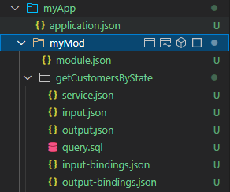

2. **Specify Input**
    - Open `input.json` file
    - Type:

        ```json
        {
            "state": "CA"
        }
        ```
    - Save and close the file

    The input for this service contains the single query parameter: `state`.

3. **Specify Output**
    - Open `output.json` file
    - Type or paste:

        ```json
        [{
            "customerNumber": 124,
            "customerName": "Mini Gifts Distributors Ltd.",
            "phone": "4155551450",
            "address": {
                "address": "5677 Strong St.",
                "city": "San Rafael",
                "state": "CA",
                "country": "USA"
            }
        }]
        ```
    - Save and close the file

    The output for this service is an array of `customers`.

    > In practice, the output is expected to be provided by the client application consuming the query service.

4. **Specify Query**
    - Open `query.json` file;
    - Compose:

        ```sql
        select customerNumber, customerName, phone, 
               addressLine1 as address, city, state, country
        from customers
        where state = :state
        ```
    - Save and close the file

    The query is a SQL statement that returns a data set for populating the `customer` objects.

    > If you have a SQL editor extension, such as `Database Client`, installed, you may validate the SQL directly in this step.

5. **Generate input and output Bindings**
    - From `getCustomersByState` service bar, click `Generate Input and Output Bindings` icon ;

    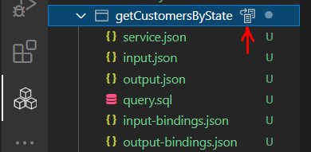

    - Open `input-bindings.json` and review the input bindings;
    - From the `output-bindings.json` bar, click the `Open with Json Viewer` icon , open and review output bindings in JSON file and JSON grid side by side:

        

        Edit output bindings, if necessary, in the JSON file and observe change in the JSON grid (skip).

    > The service engine relies on the input bindings to bind the query parameters and on the output bindings to transform the data set. The input and output bindings generated are not guaranteed to be correct 100% of the time, depending on your query problem. Thus it is important for the developer to review and correct, if needed, these bindings.

6. **Deploy Service**
    - From `getCustomerByState` service bar, click DEPLOY icon ;

    The status bar reads:

    

    or error message, if any:

    

    > The purpose of this step is to pre-validate the service.

7. **Test Service**
    - From `Tests` bar, click `Add Test` icon , to generate a test file;

    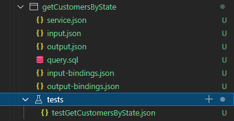

    - Open `testGetCustomerByState.json`, and edit the input;

        ```json
        {
            "name": "getCustomersByCustomerNumber",
            "input": {
                "state": "CA"
            }
        }
        ```

    - click `Run Test` button  in the upper right corner to test the service. The test result is returned on the side.

        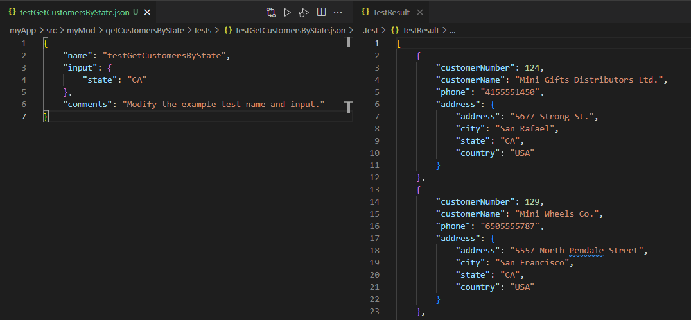


### Takeaway

There are three parts in specifying a query service:
- specifying the input and output
- specifying the query, and
- generating and reviewing the input and output bindings

The input and output defines the query problem to solve; the query, together with input and output bindings, provides the solution to the problem. Given that the input and output bindings are largely generated, the main work of query service development is to write the SQL query for populating the output object.

## Create SQL Service
---

> For this tutorial, we are to create a SQL service to update the address of a customer, and return the customer object with updated address.

### Steps

1. Generate Service
    - From `myMod` module bar, click `New SQL Service` icon .
    - Enter `updateCustomerAddress` as service name. Hit Enter.

    A SQL service named `updateCustomerAddress` is generated:

   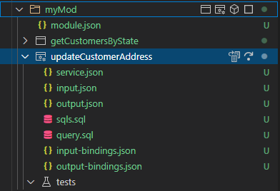

2. Specify Input
    - Open `input.json` file
    - Type or paste:

        ```json
        {
            "customerNumber": 124,
            "address": "5677 Strong St.",
            "city": "San Rafael",
            "state": "CA",
            "country": "USA"
        }        
        ```
    - Save and close the file

    The input is the address information.

3. Specify Optional Output
    - Open `output.json` file
    - Type or paste:

        ```json
        {
            "customerNumber": 124,
            "customerName": "Mini Gifts Distributors Ltd.",
            "phone": "4155551450",
            "address": {
                "address": "5677 Strong St.",
                "city": "San Rafael",
                "state": "CA",
                "country": "USA"
            }
        }
        ```
    - Save and close the file

    The output is a `customer` object.

4. Specify SQLs
    - Open `sqls.json` file
    - Compose the SQL statement(s):

        ```sql
        update customers
           set addressLine1 = :address, 
               city = :city,
               state = :state, 
               country = :country
        where customerNumber = :customerNumber
        ```
    - Save and close the file

    The SQLs is a single update statement to update the address information of a customer, although multiple DML statements may be used as needed.

    > If you have a SQL editor extension such as `Database Client` installed, you may validate the SQL directly in this step.

5. Specify Optional Query
    - Open `query.json` file
    - Compose the query:

        ```sql
        select customerNumber, customerName, phone, 
               addressLine1 as address, city, state, country
          from customers 
         where customerNumber = :customerNumber
        ```
    - Save and close the file

    The query is a SQL statement to return the `customer` data set.

6. Generate input and output Bindings
    - From `updateCustomerAddress` service bar, click `Generate Input and Output Bindings` icon . 

        The status bar reads:
    
        

        or any error message.

    - From the `input-bindings.json` bar, click the `Open with Json Viewer` icon , open and review input bindings in JSON file and JSON grid side by side:

        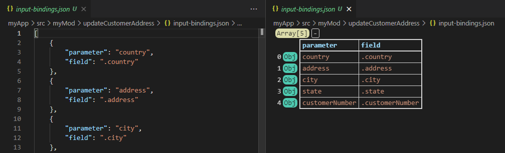

    - From the `output-bindings.json` bar, click the `Open with Json Viewer` icon , open and review output bindings in JSON file and JSON grid side by side:

        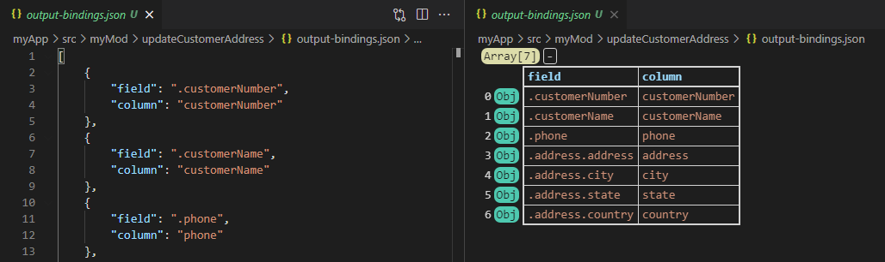

        Edit output bindings, if necessary, in JSON file and observe change in JSON grid (skip).

7. Deploy Service
    - From `updateCustomerAddress` service bar, click deploy icon ;

        The status bar reads:

        

        or any error message.

8. Test Service
    - From `Tests` bar, click `Add Test` icon , to generate a test file;

    

    - Open `testUpdateCustomerAddress.json`, and edit the input;

        ```json
            {
                "name": "testUpdateCustomerAddress",
                "input": {
                    "customerNumber": 124,
                    "address": "5677 Strong St.",
                    "city": "San Rafael",
                    "state": "CA",
                    "country": "USA"
                },
                "comments": "Modify the example test name and input."
            }    
        ```

    - click `Run Test`  button at upper right corner to test the service. The test result is returned on the side:

    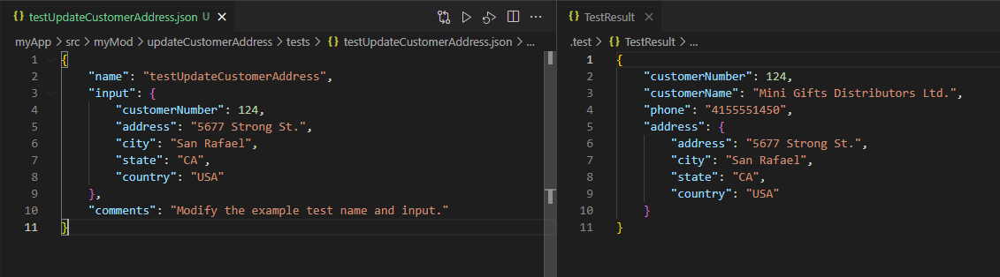


> You may also test the SQL service with the `Run Test without Commit`  button. It will run the SQL service with a rollback at the end.

### Takeaway

There are three parts in specifying a SQL service:
- specifying the input and output
- specifying the sqls and the query, and
- generating and reviewing the input and output bindings

SQL service is a command service. The focus is on the commands making database changes, or the SQL statements in the `sqls.sql` file. The query is optional and is for inspecting changes made by the commands.

## Create CRUD Service
---

> For this tutorial, we are to create a CRUD service for `Order` object. The read operation supports `getOrderByOrderNumber`, `getOrdersByCustomerNumber` and `readAllOrders`.

### Steps

1. Generate Service
    - From `myMod` module bar, click `New CRUD Service` icon .
    - Enter `Order` as service name. Hit Enter.  

    A CRUD service named `Order` is generated:

   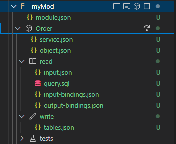

2. Specify Object
    - Open `object.json` file
    - Type or paste:

        ```json
        {
            "orderNumber": 10101,
            "orderDate": "2003-01-09T00:00:00.000Z",
            "requiredDate": "2003-01-09T00:00:00.000Z",
            "shippedDate": "2003-01-09T00:00:00.000Z",
            "status": "Shipped",
            "customerNumber": 128,
            "orderLines": [{
                "orderLineNumber": 1,
                "productCode": "S18_2795",
                "quantityOrdered": 26,
                "priceEach": 167.06
            }]
        }
        ```

    - Save and close the file

    The object is the `Order` object embedding an array of `orderLines`.

***For read***,

3. Specify READ Input
    - Open `input.json` file
    - Type:

        ```json
        {
            "orderNumber": 10101,
            "customerNumber": 128
        }
        ```

    - Save and close the file

    The input includes two query parameters to support `readOrderByOrderNumber` and `readOrdersByCustomerNumber`, respectively.

4. Specify READ Query
    - Open `query.sql` file
    - Compose:

        ```sql
        select ord.orderNumber, ord.orderDate, 
               ord.requiredDate, ord.shippedDate,
               ord.status, ord.customerNumber,
               od.orderLineNumber, od.productCode,
               od.quantityOrdered, od.priceEach
          from orders ord
          left join orderdetails od on od.orderNumber = ord.orderNumber
         where 1 = 1
           and ord.orderNumber = :orderNumber
           and ord.customerNumber = :customerNumber
         order by ord.orderNumber, od.orderLineNumber
        ```
        
    - Save and close the file

    This query supports `readOrderByOrderNumber`, `readOrdersByCustomerNumber` and `readAllOrders`. The CRUD query is dynamic by design. The `WHERE` clause of this query is formulated to support all three read operations.

5. Generate input and output Bindings
    - From `read` bar, click `Generate Input and Output Bindings` icon :

        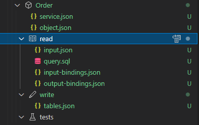

        The status bar reads:

        

    - From the `input-bindings.json` bar, click the `Open with Json Viewer` icon , open and review input bindings in JSON file and JSON grid side by side. 

    - From the `output-bindings.json` bar, click the `Open with Json Viewer` icon , open and review output bindings in JSON file and JSON grid side by side. 
    
        Edit output bindings, if necessary, in JSON file and observe change in JSON grid (skip).

***For write***,

6. Generate Table Bindings
    - From `write` bar,  click `Generate Table Bindings` icon :

        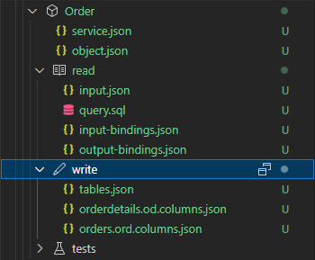
    
        The status bar reads:

        

        The `orderdetails.od.columns.json` and `orders.ord.columns.json` files are added.

    - From the `tables.json` bar, click the `Open with Json Viewer` icon , open and review table bindings in JSON file and JSON grid side by side. Close the files when done.

        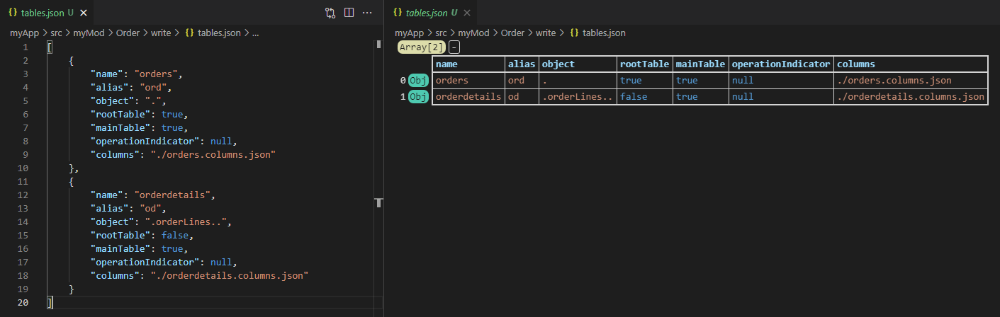

    - From the `order.columns.json` bar, click the `Open with Json Viewer` icon , open and review columns bindings for `orders` table in JSON file and JSON grid side by side. If desired, move JSON grid below JSON file for a better view of JSON grid.  Close the files when done.
    
       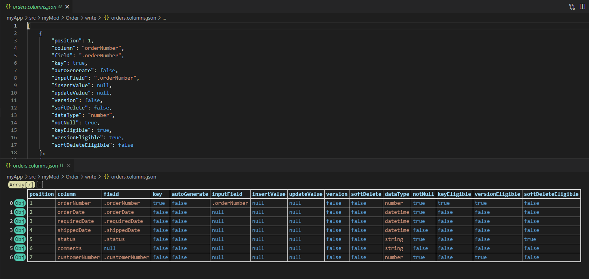

        Edit column bindings, if necessary, in JSON file and observe changes in JSON grid (skip).

    - From the `orderdetail.columns.json` bar, click the `Open with Json Viewer` icon , open and review columns bindings for `orderdetails` table in JSON file and JSON grid side by side. If desired, move JSON grid below JSON file for a better view of JSON grid. Close the files when done.

        Edit column bindings, if necessary, in JSON file and observe changes in JSON grid (skip).

7. Deploy Service
    - From `Order` service bar, click deploy icon ;

        The status bar reads:

        

        or any error message.

8. Create Tests
    - From `Tests` bar, click `Add Test`  icon;
    - Select `all` from the quick pick. Hit Enter. 

        A set of test files are generated, one for each CRUD operation:

    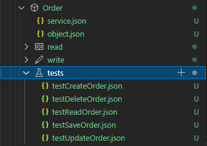

    - From `testReadOrder.json` bar, click `DUPLICATE` icon  twice to add two more `read` tests, 

    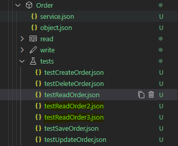

    - Rename the three read test files to `testReadAllOrders.json`, `testReadOrderByOrderNumber.json` and `testReadOrdersByCustomerNumber.json`, respective;

9. Test Create Operation

    - Open `testCreateOrder.json`, and edit the input to change the `orderNumber` to 20000:

        ```json
        {
            "name": "testCreateOrder",
            "input": {
                "orderNumber": 20000,
                "orderDate": "2003-01-09T00:00:00.000Z",
                "requiredDate": "2003-01-09T00:00:00.000Z",
                "shippedDate": "2003-01-09T00:00:00.000Z",
                "status": "Shipped",
                "customerNumber": 128,
                "orderLines": [
                    {
                        "orderLineNumber": 1,
                        "productCode": "S18_2795",
                        "quantityOrdered": 26,
                        "priceEach": 167.06
                    }
                ]
            },
            "operation": "create",
            "comments": "Modify the example test name and input."
        }        
        ```

    - click `Run Test`  button at upper-right corner to test the service. A new order is created in database and returned on the side:

    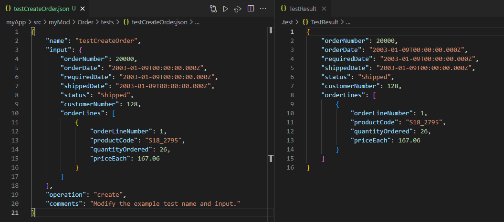

10. Test Update Operation

    - Open `testUpdateOrder.json`, and edit the input to change the `orderNumber` to 20000 and the `status` to `Delivered`:

        ```json
        {
            "name": "testUpdateOrder",
            "input": {
                "orderNumber": 20000,
                "orderDate": "2003-01-09T00:00:00.000Z",
                "requiredDate": "2003-01-09T00:00:00.000Z",
                "shippedDate": "2003-01-09T00:00:00.000Z",
                "status": "Delivered",
                "customerNumber": 128,
                "orderLines": [
                    {
                        "orderLineNumber": 1,
                        "productCode": "S18_2795",
                        "quantityOrdered": 26,
                        "priceEach": 167.06
                    }
                ]
            },
            "operation": "update",
            "comments": "Modify the example test name and input."
        }        
        ```

    - click `Run Test`  button at upper-right corner to test the service. The order is updated in database and returned on the side:

    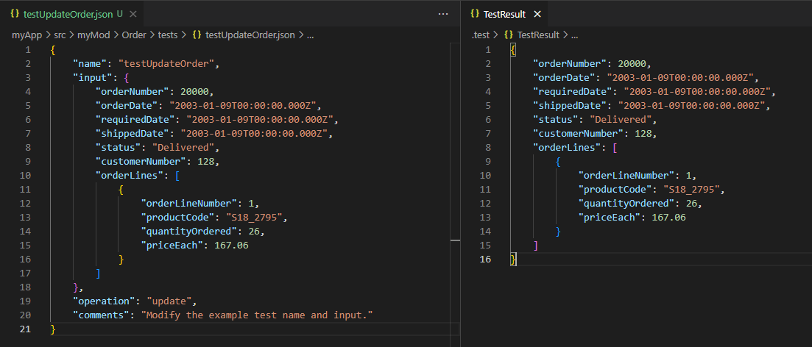

11. Test Read Operations

    - Open `testReadOrderByOrderNumber.json`, and edit the input so that it looks like:

        ```json
        {
            "name": "testReadOrderByOrderNumber",
            "input": {
                "orderNumber": 20000
            },
            "operation": "read",
            "comments": "Modify the example test name and input."
        }        
        ```

    - click `Run Test`  button at upper-right corner to test the service. The order is returned on the side:

    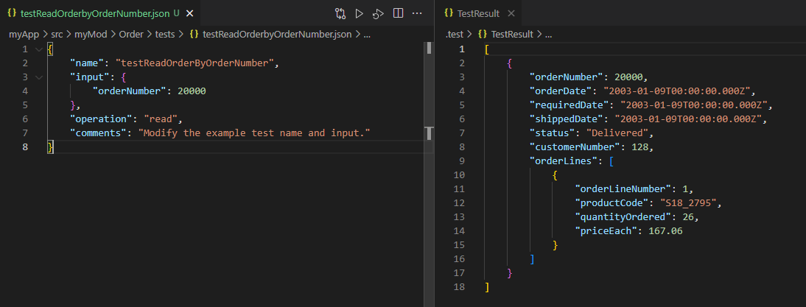

    - Open `testReadOrdersByCustomerNumber.json`, and edit the input so that it looks like:

        ```json
        {
            "name": "testReadOrdersByCustomerNumber",
            "input": {
                "customerNumber": 128
            },
            "operation": "read",
            "comments": "Modify the example test name and input."
        }        
        ```

    - click `Run Test`  button at upper-right corner to test the service. A list of orders is returned on the side:

    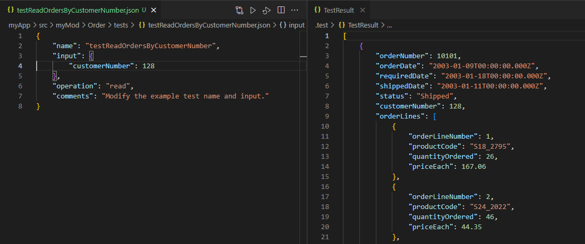

    - Open `testReadAllOrders.json`, and edit the input so that it looks like:

        ```json
        {
            "name": "testReadAllOrders",
            "input": {},
            "operation": "read",
            "comments": "Modify the example test name and input."
        }        
        ```

    - click `Run Test`  button at upper-right corner to test the service. The full list order is returned on the side:

    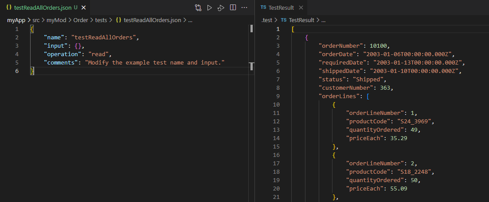

10. Test Delete Operation

    - Open `testDeleteOrder.json`, and edit the input, so that it looks like:

        ```json
        {
            "name": "testDeleteOrder",
            "input": {
                "orderNumber": 20000
            },
            "operation": "delete",
            "comments": "Modify the example test name and input."
        }
        ```

    - click `Run Test`  button at upper-right corner to test the service. The order is deleted from the database.

### Takeaway

There are three parts in specifying a CRUD service:
- specifying the object
- specifying the read component, and
- specifying the write component

The `read` component is a query, with the output being the CRUD object. Therefore, the main work in developing the read side of the CRUD service is writing the SQL query for populating the CRUD object. The CRUD query is dynamic by design, to tender the need to support different read operations.

The `write` component comprises a set of table and column bindings, which specify what tables to write and what values to write for each table when persisting the object. The table and column bindings are largely generated from the `read` component.  Therefore, the CRUD service development is centered around the SQL query of the `read` component.

## Sync Application

From the `myApp` application bar, click the the deploy icon  to redeploy the application, which syncs the application deployed in the remote workspace with the application in your local work folder.


## Inspect and Test Deployments

1. Inspect Application Deployment
    - From `Applications` bar of `DEPLOYMENTS` explorer, click `Refresh Application List` icon , to show the list of applications deployed in the workspace.

        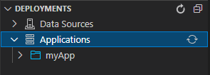

    - From `myApp` bar in `DEPLOYMENTS` explorer, click `Refresh Application` icon , to show the list of services of the application deployed in the workspace.

        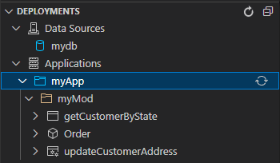

        We see all services under the `myMod` module.

2. Test Service Deployment
    - From `Order` bar in `DEPLOYMENTS` explorer, click `View Tests` icon , to show the test file for the service.

        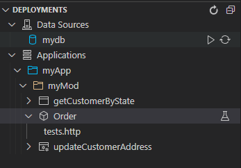

    All tests deployed into the remote workspace with the service are consolidated into a single `test.http` file, in a format that can be readily executed with the `REST Client` VS Code extension.   

    - Open the `test.http` file, and from the file click `Send Request` under `### testReadOrdersByCustomerNumber`. The test is executed and response is shown on the side.

        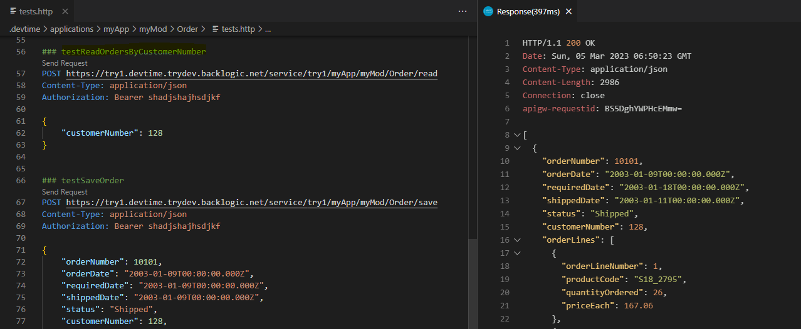

> The test is executed from the workspace service endpoint. 

## Conclusions

In this tutorial, we have shown you how to create a query, SQL and CRUD service, respectively. As you have seen, all services are around development of SQLs. Therefore, it is important to have a SQL editor extension, such as Database Client, installed in your VS Code for data access development.

## What Is Next

Move on [Data Access Service Deep Dives](/docs/DeepDive/DeepDive-QueryService.md) for a deeper understanding of data access service.

