# Getting Started with Service Builder
---

The first thing to get started with Data Access Service (DAS) is to get familiar with Service Builder. This tutorial walks you through the general steps of working with Service Builder, including

- Setup
- Development, and
- Inspecting and testing DEV deployment

As a start, we will only show you the steps to generate a simple CRUD service from DB table. For steps to create the query, SQL and non-trivial CRUD services, please move on to our second tutorial:

[Get Started with Data Access Services](/docs/GetStarted/getStartedWithDataAccessService.md)

The sample database used for both tutorials is the `classicmodels` database from `mysqltutorial.org`. The ER diagram is available [here](https://www.mysqltutorial.org/mysql-sample-database.aspx).  

The Service Builder must connect to a remote workspace to work. Therefore, as part of the setup, you will need to request and connect to a remote workspace. 

Inside the remote workspace are:

- A Service Builder Backend that does the heavy lifting for Service Builder, and
- A  Devtime Data Access Server that runs the data access applications deployed in the remote workspace.

The Service Builder connects to your data source through the remote workspace. The Devtime Server exposes the data access services deployed in the remote workspace through the service endpoint of the workspace. 

## Prerequisite
---

VS Code (version 1.56 or later) installed.

## Setup
---

### Launch VS Code

From your OS terminal, create a work folder for Service Builder and launch VS code from the work folder:

```sh
mkdir sb
cd sb
code .
```

### Install Service Builder

From the Extensions Explorer of VS Code, search and install `Service Builder Pack`, which includes the following VS Code extensions:
- [Service Builder](https://marketplace.visualstudio.com/items?itemName=BackLogic.servicebuilder)
- [JSON Grid Viewer](https://marketplace.visualstudio.com/items?itemName=DutchIgor.json-viewer), and
- [REST Client](https://marketplace.visualstudio.com/items?itemName=humao.rest-client)

The `JSON Grid View` and `REST Client` extensions are required by some functionalities of `Service Builder`.

### Activate Service Builder

Click the `Service Builder` icon  on the Activity Bar of VS Code. The `Service Builder` view opens up in the side bar, with three explorers:

- The `DATA SOURCES` explorer at the bottom, for configuring data sources in the workspace;
- The `APPLICATIONS` explorer at the top, for developing data access application in local workfolder and deploying it to remote workspace; and
- The `DEPLOYMENTS` explorer in the middle, for inspecting data sources and applications deployed in remote workspace. 

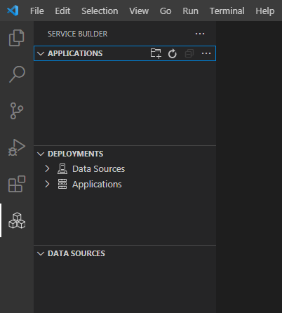

### Request Workspace

- From the `APPLICATIONS` bar, click the more icon `...`, and select `Request Workspace`;
- Enter your email address to receive the workspace connection information in the input box, and hit Enter; 
- Select `workspace and database for tutorial` from the quick pick.

A workspace is assigned and an email is sent to your email address with workspace and database connection information. `Service Builder` must connect to a data source to work. The `database for tutorial` is preloaded with the `classicmodel` database, so that you can skip database setup for this tutorial.

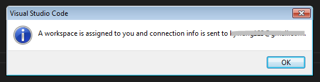

> Note that you can also request a workspace only, if you want to play with your own database.

### Connect Workspace

- From the `APPLICATIONS` bar, click the more icon `...`, and select `Connect Workspace`;
- Paste the workspace url you have received in your email into the input box, and hit Enter;
- Paste the access key you have received in your email into the next input box, and hit Enter.

    You are connected to the remote workspace.


## Development
---

### Create Data Source

1. Add Data Source
    - On the `DATA SOURCES` bar, click the `Add` icon ;
    - Enter `mydb` for the data source name in the input box, and hit Enter;
    - Select `mysql` for database type in the quick pick.

    A data source named `mydb` is created.

    

2. Configure Data Source
    - Click `mydb` and open the config file;
    - Edit the JSON fields with the database connection information you have received in your email;
    - Save the file.
  
    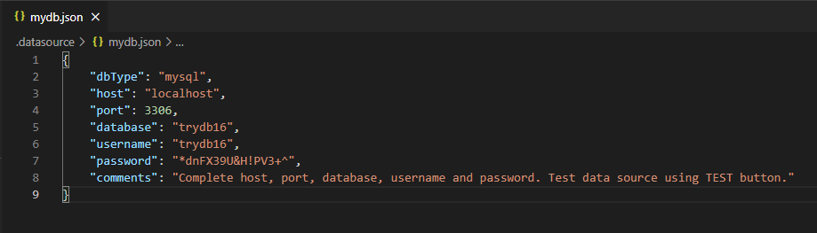

3. Test Data Source
    - Click the TEST icon  on the `mydb` bar;

    The status bar at the bottom reads "data source test succeeded".

    

4. Deploy Data Source

    - Click the DEPLOY icon  on the `mydb` bar;

    Data source is deployed into remote workspace. The status bar reads "data source deployed".

    


### Create Application

1. Generate Application
    - From the `APPLICATIONS` bar, click `New Application` icon 
    - Enter `myApp` as application name. Hit Enter.
    - Select `mysql` as database type.

    An application named `myApp` is generated:

   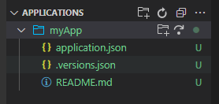

2. Configure Application
    - Open the `application.json` file;
    - Change `dataSource` value to `mydb`, and save.  

   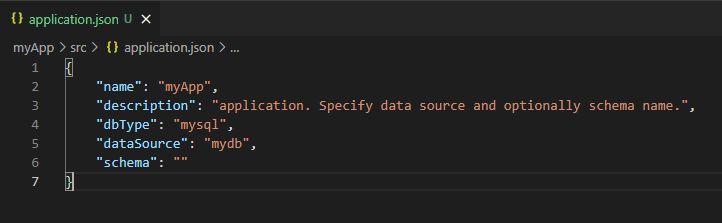

    > Note that you may optionally configure the `schema` to use with the application. Otherwise, the application schema defaults to the `database` property of the data source associated with the application, as in this case. 

3. Deploy Application

    - From the `myApp` bar, click the DEPLOY icon ;

    Application is deployed into remote workspace. The status bar reads "application deployed".

    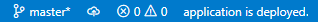

    > Note that the application must be deployed before proceeding to service development. 

### Create Module

1. Generate Module
    - From the `myApp` bar, click `New Module` icon .
    - Enter `myMod` as module name. Hit Enter.

    A module named `myMod` is generated for application `myApp`:

    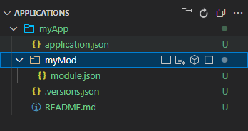

2. Configure Module
    - Skip. Nothing to configure other than a description of the module.

3. Deploy Module
    - Skip. The module will be deployed when the service is deployed.

### Generate Simple CRUD Service from Database Table

> Note: here we are to generate a simple CRUD service from the `offices` table, for a simple `Office` object mapped to the `offices` table.  You may generate simple CRUD services from multiple tables at once, but here we only generate one service from the `offices` table.

1. Generate service

    - From the `myMod` bar, click `Generate CRUD from Table icon` ;
    - Select table `offices` from the quick pick. Hit Enter;
    - Select `none` for name convention. Hit Enter.

    A simple CRUD service named `Offices` is generated for `offices` table:

    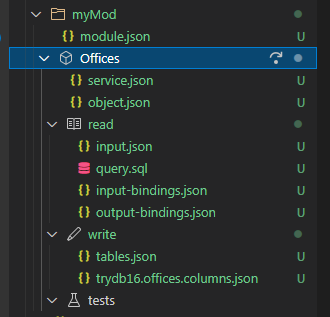

> Since no name convention is applied, the field names of the object match exactly the column names of the table. 

2. Review Service
    - Open `object.json` file to review the object structure and fields;
    - Open `input.json` file to review the input parameters for the read query;
    - Open `query.sql` file to review the SQL query for read operation;
    - From `input-bindings` bar, click the JSON viewer icon , to open and review input bindings in JSON file and JSON grid side by side:
      
        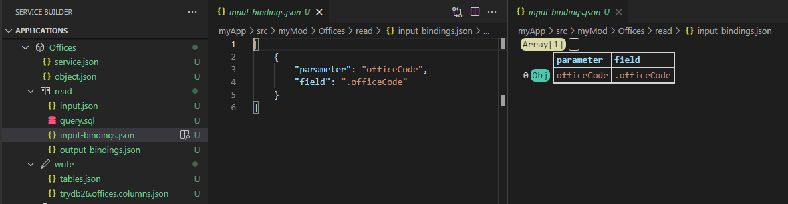 

    - From `output-bindings` bar, click the JSON viewer icon , to open and review output bindings in JSON file and JSON grid side by side;
    - From `tables` bar, click the JSON viewer icon , to open table bindings in JSON file and JSON grid side by side. Drag JSON grid below JSON file to get a better look of the table bindings:  

        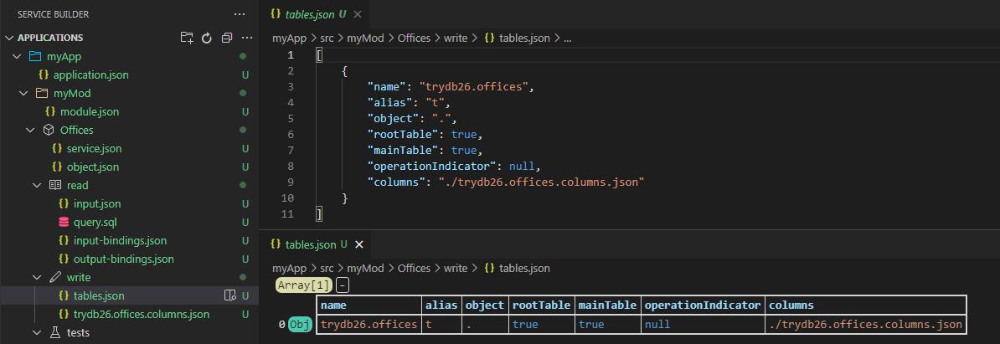 

    - From `offices.columns` bar, click the JSON viewer icon , to open columns bindings in JSON file and JSON grid side by side. Drag JSON grid below JSON file to get a better look of the column bindings.

>    To make any change to the bindings file, just edit the JSON file. The change will be automatically reflected in the JSON grid.

3. Generate Test
    - From `tests` bar, click `Add Test` icon ;
    - Select `All` from the quick pick. Hit Enter. 

    Five tests are generated, one for each CRUD operation:

    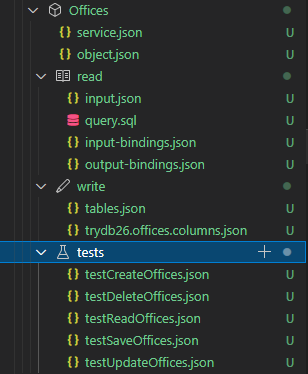

4. Executing Test
    - Open `testReadOffices.json` file;
    - Edit input of the test, to set `officeCode` to "1";
    - Click `Run Test` icon  in the upper right conner.

    Test is executed and output is return on the side.

    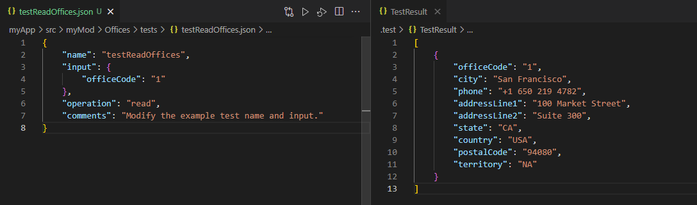

5. Deploy Service
    - From the `Offices` service bar, click the DEPLOY icon ;

    Service is deployed and the status bar reads "service deployed".

    

### Sync Application

From the `myApp` application bar, click the the DEPLOY icon  to redeploy the application, which syncs the application deployed in the remote workspace with the application in your local work folder.

## Inspect and Test Deployments
---

1. Inspect Data Source Deployment  
    - From the `Data Sources` bar of `DEPLOYMENTS` explorer, click `Refresh Data Source List` icon , to show the list of data sources deployed in the workspace.
    
        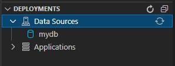

2. Inspect Application Deployment
    - From `Applications` bar of `DEPLOYMENTS` explorer, click `Refresh Application List` icon , to show the list of applications deployed in the workspace.

        

    - From `myApp` bar in `DEPLOYMENTS` explorer, click `Refresh Application` icon , to show the list of services of the application deployed in the workspace.

        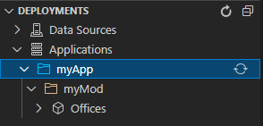

3. Test Service Deployment
    - From `Offices` bar in `DEPLOYMENTS` explorer, click `View Tests` icon , to show the test file for the service.

        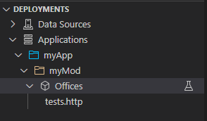

    All tests deployed into the remote workspace with the service are consolidated into a single `test.http` file, in a format that can be readily executed with the `REST Client` VS Code extension.   

    - Open the `test.http` file, and from the file click `Send Request` under `### testReadOffices`. The test is executed and response is shown on the side.

        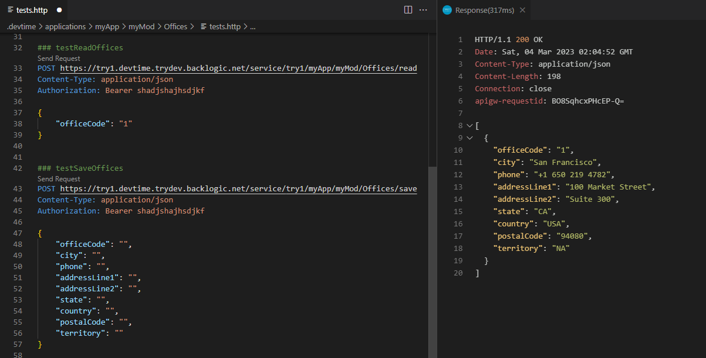

> The test is executed from the workspace service endpoint. 


## Conclusions
---

In this tutorial, we have shown you

- how to install and activate Service Builder
- how to request and connect a remote workspace  

as the setup process; shown you

- how to add and configure a data source
- how to create an application and module, and
- how to generate a simple CRUD service from DB table

as the development process; and shown you

- how to inspect the data sources and applications deployed in the remote workspace, and
- how to test the data access services deployed in the remote workspace through the workspace service endpoint

as the deployment inspection process.

## What Is Next
---

Move on to [Get Started with Data Access Services](/GetStarted/getStartedWithDataAccessService.md).

