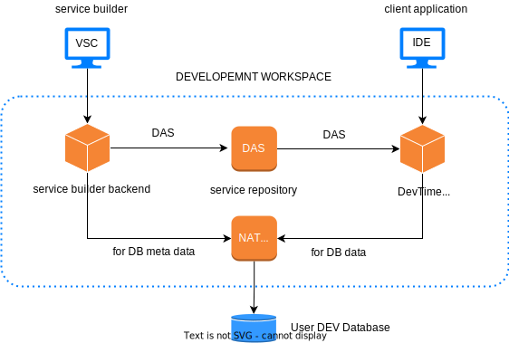
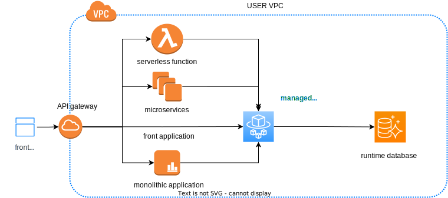

# Data Access Service

> Simplifying relational data access in cloud


## What It Is

Data access service (DAS) is a cross-platform data access layer technology for relational database. It beats the traditional ORM, raw SQL and query builder technologies in that:
- Firstly, it provides developer the flexibility of retrieving relational data in any shape and persisting object of any complexity, as the application needs, no more comprise on either object or data model; and
- Secondly, it provides developer a streamlined SQL-centric approach, where the focus of data access development is on developing SQLs, the cumbersome object-relational transformation is abstracted away, and the tedious data mapping is automated.

The serverless function and microservice application introduce additional need for light-weight data access layer and external connection pooling. DAS provides a way to externalize data access logic and to pool database connections across applications, which leaves a very-thin data access layer inside the application.

## Philosophy

DAS follows a different philosophy from traditional ORM, raw SQL and query builder technologies, and is driven by a number of ideals, including separation, decoupling, abstraction and automation.

### Separation <!-- {docsify-ignore} -->

SQL is traditionally embedded in a host language, explicitly or implicitly, which creates paradigm mismatch and shifts the focus from SQL to the host language. The essence of relational data access development is SQL development. The development paradigm should be aligned with SQL instead of the host language. DAS separates SQL from the host language, and makes data access development SQL-centric.

### Decoupling <!-- {docsify-ignore} -->

Traditional ORM maps objects directly to database tables, which creates strong coupling between object model and data model and requires comprise on either object model, data model or both. The ideal is to use SQL to encapsulate the data model from the object model and allow the two to be developed independently. DAS uses SQL mapping, instead of table mapping, to create a dynamic relationship between objects and tables.

### Abstraction <!-- {docsify-ignore} -->

Abstraction is the key to simplifying relational data access. DAS abstracts the broad data access patterns into three generic data access services: `query`, `command` and `repository`, and abstracts each of these services into a set of SQL and JSON components. That leaves us with three standardized data access services that can be specified simply with SQL and JSON.

The **query service** is for retrieving data from database. A SQL query service (aka query service) comprises:
- input
- output
- query
- input bindings, and
- output bindings

where `query` is a single SQL statement returning a relational data set for populating the output. The hard relational-to-object transformation problem is abstracted away and reduced to a simple data mapping problem.

The **command service** is for manipulating data in database. A SQL command service (aka SQL service) comprises:
- input
- sqls
- input bindings
- optional output
- optional query, and
- optional output bindings

where `sqls` is a sequence of DML statements to be executed against the database. The `optional query` is for returning updated data if desired. 

The **repository service** is for CRUD operations of aggregate objects. A CRUD repository service (aka CRUD service) comprises:
- object
- read
    - input
    - query
    - input bindings
    - output bindings
- write
    - table bindings
    - column bindings

where the `read` component is essentially a dynamic query service supporting read operations; while the `write` component is a set of table and column bindings replacing the trivial `insert`, `update` and `delete` statements for write operations. 

### Automation <!-- {docsify-ignore} -->

Data mapping should be automated. The various data bindings of data access services can largely be derived from the data and SQL components of respective data access services, that is
- the input and output bindings can be generated from the `input`, `output` and `query` components for query service
- the input and output bindings can be generated from the `input`, `output`, `sqls` and `query` components for SQL service
- the input and output bindings can be generated from the `object`, `input` and `query` components for the `read` component of CRUD service
- the table and column bindings can be generated from the `read` component for the `write` component of CRUD service; and even
- the complete simple CRUD service can be generated from DB table.

The developer should not be hand-coding these data binding components from scratch, but reviewing and editing, if needed, the data bindings generated by development tools.

## Sample

The following are sample query, SQL and CRUD services for illustration purpose. They are specified with plain SQL and JSON.

<!-- tabs:start -->
#### **Query Service**

The following are the various components of a sample query service `getCustomerById` for illustration purpose. 

<!-- tabs:start -->
#### **Input**

```json
{
    "customerId": 123
}
```

#### **Output**

```json
{
    "customerId": 123,
    "customerName": "Joe",
    "address": {
        "address": "1145 Main St.",
        "city": "Los Angeles",
        "State": "CA"
    }
}
```

#### **Query**

```sql
SELECT c.customer_id, c.customer_name,
       a.address, a.city, a.state
  FROM customers c
  JOIN addresses a ON a.customer_id = c.customer_id
 WHERE c.customerId = :customerId
```

#### **Input Bindings**

```json
[
    {"parameter": "customerId", "field": ".customerId"}
]
```

#### **Output Bindings**

```json
[
    {"field": ".customerId", "column": "customer_id"},
    {"field": ".customerName", "column": "customer_name"},
    {"field": ".address.address", "column": "address"},
    {"field": ".address.city", "column": "city"},
    {"field": ".address.state", "column": "state"}
]
```

<!-- tabs:end -->

#### **SQL Service**

The following are the various components of a sample SQL service `updateCustomerAddress` for illustration purpose.

<!-- tabs:start -->
#### **Input**

```json
{
    "customerId": 123,
    "address": "1145 Main St.",
    "city": "Los Angeles",
    "State": "CA"
}
```

#### **Sqls**

```sql
UPDATE addresses
   SET address = :address,
       city = :city,
       state = :state
 WHERE customer_id = :customerId

```

#### **Input Bindings**

```json
[
    {"parameter": "customerId", "field": ".customerId"},
    {"parameter": "address", "field": ".address"},
    {"parameter": "city", "field": ".city"},
    {"parameter": "state", "field": ".customerId"}
]
```

<!-- tabs:end -->


#### **CRUD Service**

The following are the various components of a sample CRUD service `Order` for illustration purpose. The read operation supports: `getOrderById`, `getOrderByCustomerId` and `getAllOrders`.

<!-- tabs:start -->
#### **Object**

```json 
{
    "orderId": 1,
    "customerId": 2,
    "orderLines": [{
        "lineId": 1,
        "productId": 2,
        "qty": 3
    }]
}
```

#### **Read: Input**

```json
{
    "orderId": 1,
    "customerId": 2
}
```

#### **Read: Query**

```sql
SELECT o.order_id, o.customer_id,
       l.line_id, l.product_id, l.qty
  FROM orders o
  LEFT JOIN order_lines l on l.order_id = o.order_id
 WHERE 1 = 1
   AND o.order_id = :orderId
   AND o.customer_id = :customerId
```

#### **Read: Input Bindings**

```json
[
    {"parameter": "orderId", "field": ".orderId"},
    {"parameter": "customerId", "field": ".customerId"}
]
```

#### **Read: Output Bindings**

```json
[
    {"field": ".orderId", "column": "order_id"},
    {"field": ".customerId", "column": "customer_id"},
    {"field": ".orderLine.lineId", "column": "line_id"},
    {"field": ".orderLine.productId", "column": "product_id"},
    {"field": ".orderLine.qty", "column": "qty"}
]
```

#### **Write: Table Bindings**

```json
[
    {
        "name": "orders",
        "alias": "o",
        "object": ".",
        "rootTable": true,
        "mainTable": true,
        "columns": "./orders.o.columns.json"
    },
    {
        "name": "orderDetails",
        "alias": "l",
        "object": ".orderLines..",
        "rootTable": false,
        "mainTable": false,
        "columns": "./order_lines.l.columns.json"
    }
]
```


#### **Write: Column Bindings**

The following shows the column bindings for `orders` table, abbreviated for brevity. The column bindings for `order_lines` table are skipped.

```json
[
    {
        "position": 1,
        "column": "order_id",
        "field": ".orderId",
        "key": true,
        "autoGenerate": false,
        "inputField": ".orderId",
        "insertValue": null,
        "updateValue": null,
        "version": false,
        "softDelete": false,
        "dataType": "number",
        "notNull": true,
        "keyEligible": true,
        "versionEligible": true,
        "softDeleteEligible": false
    },
    {
        "position": 2,
        "column": "customer_id",
        "field": ".customerId",
        "key": false,
        "autoGenerate": false,
        "inputField": null,
        "insertValue": null,
        "updateValue": null,
        "version": false,
        "softDelete": false,
        "dataType": "number",
        "notNull": true,
        "keyEligible": true,
        "versionEligible": true,
        "softDeleteEligible": false
    },
    ...
]
```

<!-- tabs:end -->

<!-- tabs:end -->

## Target

DAS sits between the database and the client application that needs data access. The primary target of DAS is serverless function and microservice application, which stand to profit the most from externalizing data access layer. The second target of DAS is front application, Angular application for example, that likes to hold light business logic in front and access database directly. Lastly, DAS can help any application that likes to defer data access logic to a backend service and take advantage of the simplicity and performance of data access services. 

As DAS is deployed as HTTP API, it is a cross-platform solution for client application authored with any language, as long as it can send HTTP request. However, DAS does have specialized data access client planned for Java, TypeScript and Python, to further simplify data access in these languages.

## Service Builder

DAS has `Service Builder` as the tool for data access service development. It is implemented as a VS Code extension, so that developer can take advantage of the rich list of SQL and JSON tools available in the VS Code ecosystem. The `Service Builder` provides function for creating/generating data access applications, modules, services and tests.

## Workspace

`Service Builder` is an online development tool, meaning that it must connect to a `remote workspace` to work. The `remote workspace` hosts the `Service Builder Backend` that does the heavy lifting for `Service Builder`. It also hosts a devtime `data access server` that serves the data access services deployed in the workspace to support client application development, and a NAT server for accessing user DEV database. The `remote workspace` is provided as a service, for the convenience of developer.
  
---

 

---

## Runtime Instance

The runtime `data access server` instance is meant to be launched in user VPC, close to the runtime database, with cloud services like AWS AppRunner, ECS Fargate etc., as managed service. Then a multitude of data access applications can be deployed on the instance to provide data access services to serverless functions, microservice applications, front applications and monolithic applications in the cloud. If the databases for the applications are hosted on the same database server, the database connections can be pooled across these applications.

---



---

## Data Access Client

DAS has a specialized data access client planned for Java, TypeScript, and Python, respectively, to simplify data access coding in these languages. For example, in the case of Java, the developer would simply write an annotated interface for a repository:

```java
@RepositoryService("/../Order")
public interface OrderRepository {
    @read
    public Order getOrderByOrderNumber(int orderNumber);

    @read
    public List<Order> getOrderByCustomerNumber(int customerNumber);

    @create
    public Order create(Order order);

    @update
    public List<Order> save(List<Order> orders);

    @delete
    public void delete(int orderNumber);
}
```

The Java data access client would provide an implementation behind the scene and invokes the data access service when any of the methods is called.

## Project

DAS is a project in progress. 

Currently, I have the `Service Builder` available for install from VS Code marketplace and `Remote Workspace` available for request from inside of `Service Builder`. Essentially, I have the tool and hosted DEV environment ready for you to play and try. You may start with the tutorials, deep dives and user guide available here to get familiar with Service Builder and data access services in general, and then move on to your own real or hypothetic data access problems. I will appreciate any feedback you may have in this phase.

In the next phase, I will be implementing the `Data Access Client` for Java, TypeScript and Python, so that you will be able to easily consume data access service from your Java, TypeScript and Python application.

In the third phase, I will be adding the capability to launch `Runtime Instance` as managed service inside your own VPC, so that you can run your production load in your own VPC, close to your own database. 

